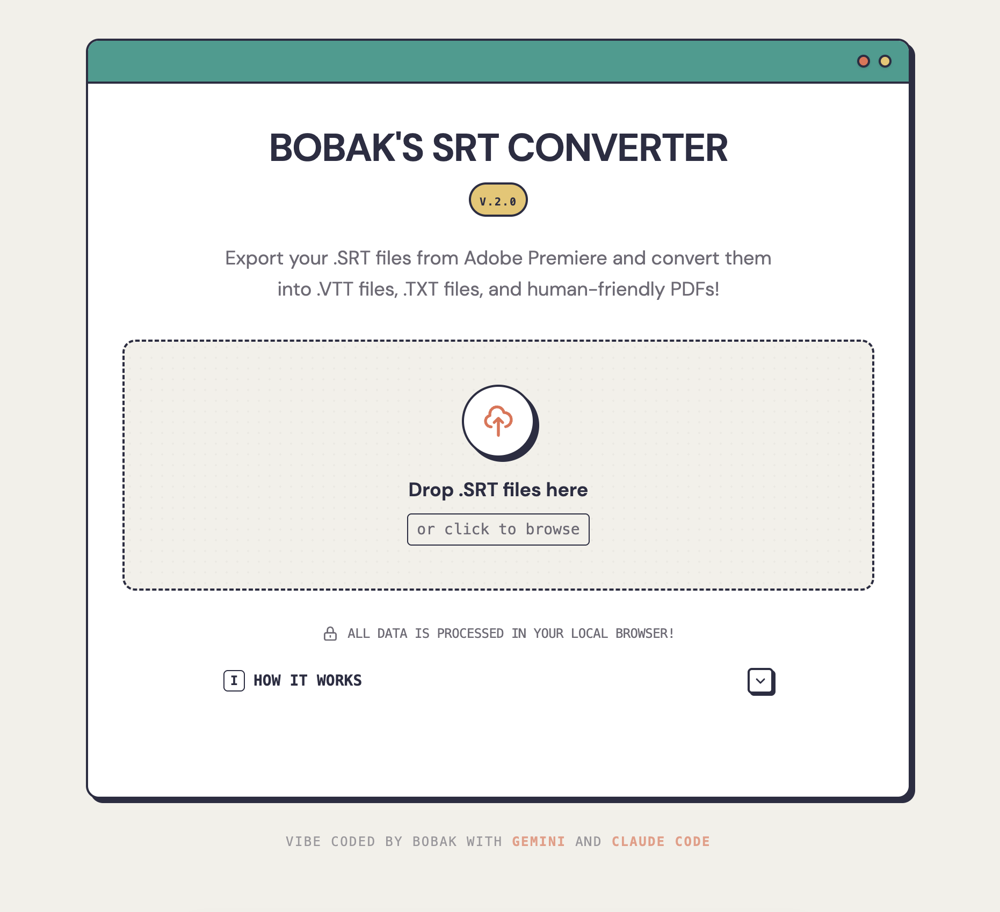

# SRT Converter

A browser-based tool for converting subtitle files (.srt) to VTT, TXT, and PDF formats. All processing happens client-side—no files are uploaded to any server.

## Features

- **SRT → VTT**: Converts timecodes for web video players
- **SRT → TXT**: Extracts plain text with smart paragraph grouping
- **SRT → PDF**: Generates formatted PDF documents via jsPDF
- **Batch processing**: Convert multiple files at once
- **ZIP download**: Download all converted files in a single archive

## Tech Stack

- React 19
- Vite
- Tailwind CSS v4
- jsPDF & JSZip

---

### 🎸 Vibe Coding Experiment

This is my first "vibe coding" deployment—built using **Gemini** and **Claude Code** to see how far AI-assisted development can go. The goal was to solve a task I do often: converting SRT caption files (generated by Adobe Premiere) into PDFs and VTTs.
